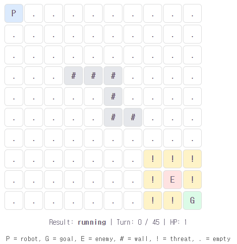
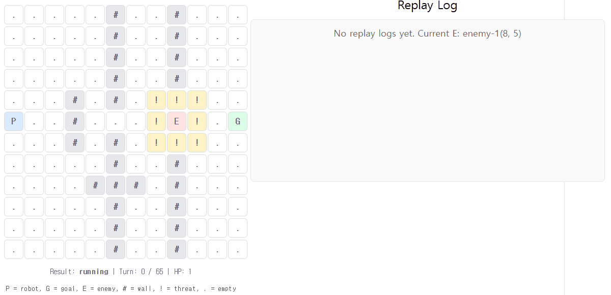

# Tactics Game Agent MVP

Demo: https://junseongahn.github.io/tactical-game-agent/

A small game-agent prototype for testing tactic selection, wall-use behavior, and AI-assisted adaptive decision logic.

## TL;DR

Fixed tactics fail differently.

- **Wall-aware** works well on simple maps.
- **Composite** handles harder maps better.
- **AI-adaptive** switches between them using a difficulty estimate.

Key result:

> AI-adaptive stays above the weaker baseline between wall-aware and composite, and sometimes performs better than both.

## Demo



The agent chooses actions using goal position, enemy pressure, wall structure, and threat zones.

## Wall-Use Example



The wall-aware tactic uses walls to reduce enemy exposure while still moving toward the goal.

- **Turn 3**: avoids the shortest open path
- **Turn 6**: keeps using the wall corridor under pressure
- **Turn 7**: keeps wall cover while progressing to the goal

## Tactics

### Wall-Aware

Simple wall-use logic. Strong on easier maps, weaker on harder maps.

### Composite

Combines goal progress, enemy distance, threat zones, health, and obstacle context. Stronger on harder maps, but sometimes too conservative on easy maps.

### AI-Adaptive

Uses an AI-assisted difficulty estimate to switch between wall-aware and composite.

```ts
difficulty =
  unsafe path
+ enemy-controlled direct route
+ close enemy pressure
+ multiple enemies
+ weak wall / obstacle cover
